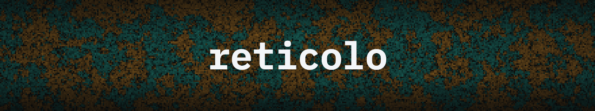

<p align="center">
  
</p>

<p align="center">
  <a href="https://github.com/olmo-francesconi/reticolo/actions/workflows/ci.yml"></a>
  
  
  
  <a href="LICENSE"></a>
</p>

# reticolo

**reticolo** is a C++20 library for Monte Carlo simulation of lattice quantum
field theories. It provides scalar and gauge field actions on periodic
hypercubic lattices, samples them with Hybrid Monte Carlo, and reconstructs the
density of states with the LLR algorithm. An optional CUDA backend runs the same
simulations on the GPU. Configurations and observables are written to
self-describing HDF5.

## Features

- **Field theories** — scalar φ⁴, φ⁶ and sine-Gordon; the O(2)/XY model; a
  charged scalar with a sign problem (Bose gas); and Wilson gauge theory for
  U(1), SU(2) and SU(3).
- **Updates** — Hybrid Monte Carlo with Leapfrog, second-order Omelyan and
  fourth-order Omelyan molecular-dynamics integrators.
- **Density of states** — LLR reconstruction (Newton–Raphson and Robbins–Monro
  adaptation with replica exchange) over parallel windowed HMC chains.
- **GPU** — optional CUDA backend covering HMC for every action in single and
  double precision, sharing one per-site formula with the CPU code.
- **Random number generators** — xoshiro256++, Philox4×32, Mersenne Twister and
  RANLUX behind a common interface.
- **Output** — self-describing HDF5 carrying the full run record (command line,
  git commit, compile flags) with checkpoint/resume from any trajectory.

## Requirements

- A C++20 compiler (GCC, Clang or Apple Clang)
- CMake ≥ 3.25 and Ninja
- HDF5
- OpenMP — optional, for LLR replica parallelism
- CUDA — optional, for the GPU backend

## Building

```sh
cmake --preset macos-appleclang   # or macos-llvm, linux-gcc, linux-clang, debug, linux-nvcc
cmake --build --preset macos-appleclang
ctest --preset macos-appleclang
```

## Usage

A simulation composes a field, an RNG, an action, an updater and a writer, then
runs the trajectory loop:

```cpp
#include <reticolo/reticolo.hpp>

int main() {
    using namespace reticolo;

    Lattice<double>   phi{{8, 8, 8, 8}};
    FastRng           rng{42};
    act::Phi4<double> action{.kappa = 0.18, .lambda = 1.0};
    alg::Hmc          hmc{action, phi, rng, {.tau = 1.0, .n_md = 20}};

    io::Writer writer{"phi4.h5"};
    auto       s = writer.series<double>("/prod/obs/s");

    for (int i = 0; i < 1000; ++i) {
        hmc.step();
        s.append(action.s_full(phi));
    }
}
```

The `apps/` directory contains a reference HMC and LLR program for each action.
Output is read back with any HDF5 tool; run metadata lives in the `/run` and
`/vars` attributes and each observable is a 1-D dataset:

```python
import h5py, numpy as np

with h5py.File("phi4.h5", "r") as f:
    s = np.asarray(f["/prod/obs/s"])
    print(f["/run"].attrs["commit"], s.mean())
```

## Documentation

- [`docs/architecture.md`](docs/architecture.md) — library design and data model
- [`docs/writing_an_app.md`](docs/writing_an_app.md) — adding an action, app or test
- [`docs/cuda_architecture.md`](docs/cuda_architecture.md) — the GPU backend

## License

Released under the MIT License — see [LICENSE](LICENSE).
